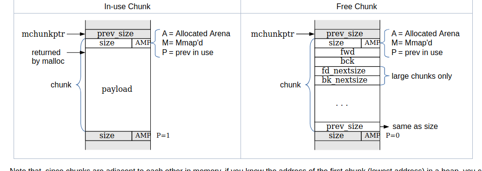

# Malloc: Allocating the memory

If we need to get the understanding of the heap, we need to know the workflow of malloc from every aspects, following is the note:-


# What we will learn:-

* Arena: A structure which is shared among multiple threads to refernce them with one another without overlapping another. Depreceated: `dmalloc`, replaced with `ptmalloc`

* Heap:  The contiguous memory region allocated at the runtime. Each heap belongs to exactly one arena.
* Chunk: Small ranges of memory regions implemented as linked list to contains the references of one another. Each chunk exist in one heap which exists in one arena.

* Memory: A region of application address which will be taken into use during dynamic allocation.


# What is Chunk?

A chunk is the subdivison of the heap region which has been allocated, when we allocate a memory region, the heap management gives a pointer to the the chunk from the heap region, this chunk will have the `data` we want to store and `metadata`(this contains the size of the heap and other valuable information which will have a look later), now when this region will be `free`'d,  the memory that used to be application data is re-purposed for additional arena-related information,e `data` will be cleared.


Upon another allocation within the same process, the free'd pointer will be given to the new allocation region of the memory, this is taken care by the heap manager, we will see on that.


> `mchunk_ptr` does not point to the beginning of the chunk instead it points to the last word of the previous chunk. The first field of `mchunkptr` is not valid unless the previous chunk if free.

The last word of the allocated chunk contains a copy of the chunk size with 3 Leas Significant bit corresponding to the chunk information.

# Metadata of the chunks

There are two types of chunks that we need to focus on, as we know, one being the chunk which corresponds to the allocated region of the memory and the second being the chunk which corresponds the memory region which has been free'd.





The `In-use` chunk help us to get a better understanding of the metadata a chunk contains, the first `prev_size` contains the size of the chunk just before the chunk we are examining. Then it contains `size`, the size shows the size of the chunk including the metadata. Then the `AMP`, which is the abbreviation of `Arena`, `Mmap` and `Prev In Use`, these are denoted by the least 3 bits of the size metdata.

* `Arena`      : This bit, if set tells us that the chunk has came from main arena and the heap.
* `Mmap`       : This bit, if set tells us that this chunk has been mmap'd and is not a part of heap.
* `Prev in use`: This bit, if set tells us that the chunk, before the current one is in use by the application.

> `Prev in use`: Although sometime, the fastbin consider to have some kind of optimization later setup, so even if the previous bin has been free'd the chunk in the fastbin have this bet set to `1` this is because fastbin are used to optimize the work of allocating and recycling the region.

Then the chunk, the payload contains the user data, the `malloc` call returns the the `payload` region in addition to size and `AMP`. 

##### Free chunk layout


The free chunk denotes the layout of a chunk which has been freed which after deallocation by a call to `free`. There are several metadata which is taken into consideration when dealing with a free'd chunk. These include:-

> The `mchunk_ptr` points to the `prev_size` of the free'd chunk.

We have a `size` and `AMP` field which we already know the use of. There are two other important attributes i.e. `fwd` and `bck`, these two points to the backward chunk which has is free and the `fwd` points to the forward free chunk. `fd_nextsize` denotes the size of the chunk denoted by `fwd` and the `bk_nextsize` denotes the size of chunk denoted by `bck`. Then the area shown as blank is the free region where the user data resided but now has been free'd.


```r
gef➤  disas main
Dump of assembler code for function main:
   0x00000000004005c7 <+0>:	push   rbp
   0x00000000004005c8 <+1>:	mov    rbp,rsp
   0x00000000004005cb <+4>:	sub    rsp,0x10
   0x00000000004005cf <+8>:	lea    rdi,[rip+0xee]        # 0x4006c4
   0x00000000004005d6 <+15>:	call   0x4004b0 <puts@plt>
   0x00000000004005db <+20>:	mov    edi,0x8
   0x00000000004005e0 <+25>:	call   0x4004d0 <malloc@plt>
   0x00000000004005e5 <+30>:	mov    QWORD PTR [rbp-0x8],rax
   0x00000000004005e9 <+34>:	mov    rax,QWORD PTR [rbp-0x8]
   0x00000000004005ed <+38>:	mov    DWORD PTR [rax],0x6c6c6548
   0x00000000004005f3 <+44>:	mov    WORD PTR [rax+0x4],0x6f
   0x00000000004005f9 <+50>:	mov    rdx,QWORD PTR [rbp-0x8]
   0x00000000004005fd <+54>:	mov    rax,QWORD PTR [rbp-0x8]
   0x0000000000400601 <+58>:	mov    rsi,rax
   0x0000000000400604 <+61>:	lea    rdi,[rip+0xd7]        # 0x4006e2
   0x000000000040060b <+68>:	mov    eax,0x0
   0x0000000000400610 <+73>:	call   0x4004c0 <printf@plt>
   0x0000000000400615 <+78>:	lea    rdi,[rip+0xd7]        # 0x4006f3
   0x000000000040061c <+85>:	call   0x4004b0 <puts@plt>
   0x0000000000400621 <+90>:	mov    rax,QWORD PTR [rbp-0x8]
   0x0000000000400625 <+94>:	mov    rdi,rax
   0x0000000000400628 <+97>:	call   0x4004a0 <free@plt>
   0x000000000040062d <+102>:	lea    rdi,[rip+0xd6]        # 0x40070a
   0x0000000000400634 <+109>:	call   0x4004b0 <puts@plt>
   0x0000000000400639 <+114>:	mov    eax,0x0
   0x000000000040063e <+119>:	leave  
   0x000000000040063f <+120>:	ret    
End of assembler dump.
gef➤  b *0x00000000004005ed
Breakpoint 1 at 0x4005ed
gef➤  b *0x000000000040063f
Breakpoint 2 at 0x40063f
gef➤  
```


